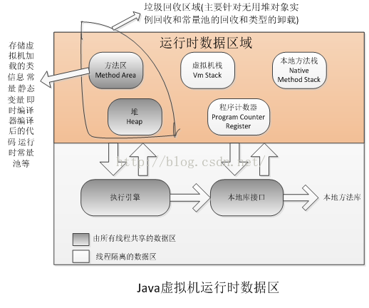

  
 方法区和Java堆都是内存共享,方法区又被称为非堆(Non-Heap).又称为“永久带”.
 
####1.程序计数器：
线程私有。是一块较小的内存，是当前线程所执行的字节码的行号指示器。是Java虚拟机规范中唯一没有规定OOM（OutOfMemoryError）的区域。

####2.Java栈：
线程私有。生命周期和线程相同。是Java方法执行的内存模型。执行每个方法都会创建一个栈帧，用于存储局部变量和操作数（对象引用）。局部变量所需要的内存空间大小在编译期间完成分配。所以栈帧的大小不会改变。存在两种异常情况：若线程请求深度大于栈的深度，抛StackOverflowError。若栈在动态扩展时无法请求足够内存，抛OOM。

####3.Java堆：
所有线程共享。虚拟机启动时创建。存放对象实力和数组。所占内存最大。分为新生代（Young区），老年代（Old区）。新生代分Eden区，Servior区。Servior区又分为From space区和To Space区。Eden区和Servior区的内存比为8:1。 当扩展内存大于可用内存，抛OOM。

####4.方法区：
所有线程共享。用于存储已被虚拟机加载的类信息、常量、静态变量等数据。又称为非堆（Non—Heap）。方法区又称“永久代”。GC很少在这个区域进行，但不代表不会回收。这个区域回收目标主要是针对常量池的回收和对类型的卸载。当内存申请大于实际可用内存，抛OOM。

####5.本地方法栈：
线程私有。与Java栈类似，但是不是为Java方法（字节码）服务，而是为本地非Java方法服务。也会抛StackOverflowError和OOM。

---

Hotspot VM将内存划分为不同的物理区，就是“分代”思想的体现。如图所示，JVM内存主要由新生代、老年代、永久代构成。

GC影响

① 新生代（Young Generation）：大多数对象在新生代中被创建，其中很多对象的生命周期很短。每次新生代的垃圾回收（又称Minor GC）后只有少量对象存活，所以选用复制算法，只需要少量的复制成本就可以完成回收。

新生代内又分三个区：一个Eden区，两个Survivor区（一般而言），大部分对象在Eden区中生成。当Eden区满时，还存活的对象将被复制到两个Survivor区（中的一个）。当这个Survivor区满时，此区的存活且不满足“晋升”条件的对象将被复制到另外一个Survivor区。对象每经历一次Minor GC，年龄加1，达到“晋升年龄阈值”后，被放到老年代，这个过程也称为“晋升”。显然，“晋升年龄阈值”的大小直接影响着对象在新生代中的停留时间，在Serial和ParNew GC两种回收器中，“晋升年龄阈值”通过参数MaxTenuringThreshold设定，默认值为15。

② 老年代（Old Generation）：在新生代中经历了N次垃圾回收后仍然存活的对象，就会被放到年老代，该区域中对象存活率高。老年代的垃圾回收（又称Major GC）通常使用“标记-清理”或“标记-整理”算法。整堆包括新生代和老年代的垃圾回收称为Full GC（HotSpot VM里，除了CMS之外，其它能收集老年代的GC都会同时收集整个GC堆，包括新生代）。

③ 永久代（Perm Generation）：主要存放元数据，例如Class、Method的元信息，与垃圾回收要回收的Java对象关系不大。相对于新生代和年老代来说，该区域的划分对垃圾回收影响比较小。

---
默认的，新生代 ( Young ) 与老年代 ( Old ) 的比例的值为 1:2 ( 该值可以通过参数 –XX:NewRatio 来指定 )，即：新生代 ( Young ) = 1/3 的堆空间大小。
老年代 ( Old ) = 2/3 的堆空间大小。其中，新生代 ( Young ) 被细分为 Eden 和 两个 Survivor 区域，这两个 Survivor 区域分别被命名为 from 和 to，以示区分。
默认的，Edem : from : to = 8 : 1 : 1 ( 可以通过参数 –XX:SurvivorRatio 来设定 )，即： Eden = 8/10 的新生代空间大小，from = to = 1/10 的新生代空间大小。
JVM 每次只会使用 Eden 和其中的一块 Survivor 区域来为对象服务，所以无论什么时候，总是有一块 Survivor 区域是空闲着的。
因此，新生代实际可用的内存空间为 9/10 ( 即90% )的新生代空间。

参考:
https://blog.csdn.net/YHYR_YCY/article/details/52566105
https://tech.meituan.com/jvm_optimize.html

---
##GC
垃圾回收统计信息
```
-XX:+PrintGC 
-XX:+PrintGCDetails 
-XX:+PrintGCTimeStamps 
-Xloggc:filename
```
参考:https://blog.csdn.net/renfufei/article/details/49230943
##JVM参数
```
-Xmx   Java Heap最大值，默认值为物理内存的1/4，最佳设值应该视物理内存大小及计算机内其他内存开销而定；

-Xms   Java Heap初始值，Server端JVM最好将-Xms和-Xmx设为相同值，开发测试机JVM可以保留默认值；

-Xmn   Java Heap Young区大小，不熟悉最好保留默认值；

-Xss   每个线程的Stack大小，不熟悉最好保留默认值；
```
参考:https://blog.csdn.net/sdujava2011/article/details/50086933
